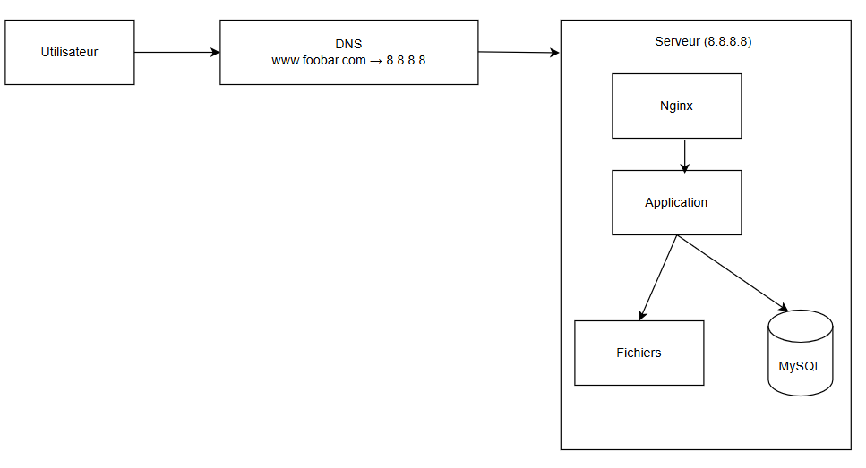

# Simple Web Infrastructure

---

## **1. Infrastructure Diagram**

When a user wants to access `www.foobar.com`, here’s what happens:

1. The user types `www.foobar.com` in their browser.
2. The browser asks a DNS server to translate `www.foobar.com` into an IP address (`8.8.8.8`).
3. The request reaches the server, where Nginx, the application server, and MySQL work together to send back the webpage.

---

## **2. Component Explanations**

#### **Server**

A **powerful computer** that stays on 24/7 to run your website. *Example*: Like a store that’s always open.

------

#### **Domain Name (`foobar.com`)**

The **easy-to-remember address** for your site (instead of having to type `8.8.8.8`). *Example*: Like saying "McDonald's" instead of "123 Main Street."

------

#### **DNS Record (Type A)**

The **rule that links `www.foobar.com` to `8.8.8.8`**. *Example*: Like a name tag on a mailbox: "Martin’s House → 12 Maple Street."

------

#### **Nginx (Web Server)**

The **first point of contact** when someone visits your site.

- Sends simple files like images and basic pages.
- For complex pages (like user accounts), it asks the **application server** for help.

*Example*: Like a hostess at a restaurant.

------

#### **Application Server**

The **engine** of your site. It:

- Runs your code (PHP, Python, etc.).
- Prepares personalized pages (e.g., "Hello, Anne-Cécile!").

*Example*: Like a chef making your custom burger.

------

#### **Database (MySQL)**

The **memory** of your site. It stores:

- User accounts.
- Articles, orders, etc.

*Example*: Like a big filing cabinet where everything is organized.

------

#### **Communication (HTTP/HTTPS)**

Your computer and the server **talk** using this language. *Example*: Like ordering coffee: "One espresso, please!" → "Here you go!"

---

## **3. Problems with This Setup**

#### **SPOF (Single Point of Failure)**

If the **server crashes**, the entire site **goes down**. *Example*: If the only checkout counter in a supermarket breaks, no one can pay.

------

#### **Downtime (Site Unavailable During Updates)**

When you **update your site**, you have to **restart the server** → the site is **unavailable** for a few minutes. *Example*: Like closing a store for 5 minutes to change the cash register.

------

#### **No Scalability (Too Many Visitors = Crash)**

A single server **can’t handle lots of people at once**. *Example*: If 100 people show up at a small restaurant at the same time, everyone will have to wait forever.

##
