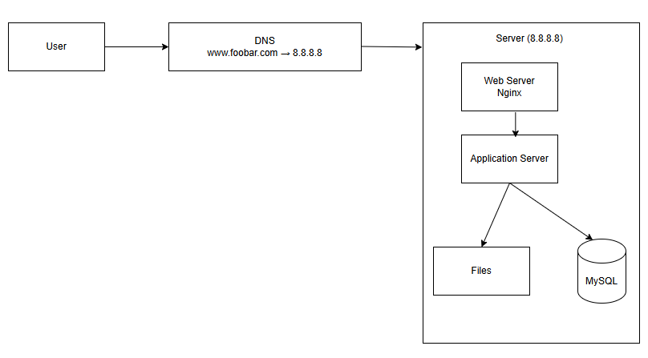

# Simple Web Infrastructure

---

## **1. Infrastructure Diagram**

When a user wants to access `www.foobar.com`, here’s what happens:

1. The user types `www.foobar.com` in their browser.
2. The browser asks a DNS server to translate `www.foobar.com` into an IP address (`8.8.8.8`).
3. The request reaches the server, where Nginx, the application server, and MySQL work together to send back the webpage.

---

