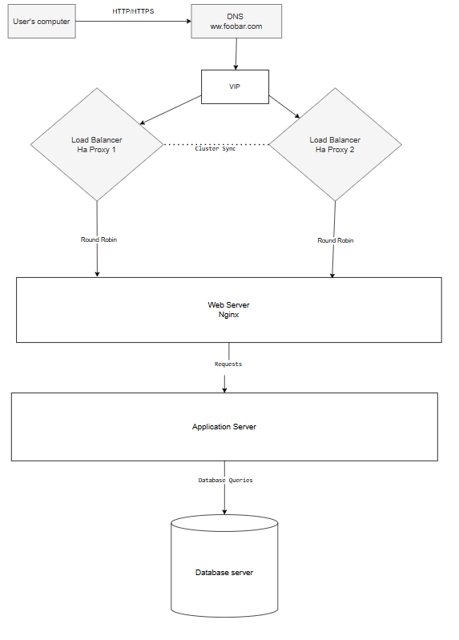

## Infrastructure Overview
This design separates the web server, application server, and database server, and includes a cluster of load balancers for high availability.

## Components
- **DNS**:
  - Resolves the domain name to a Virtual IP (VIP) shared by the load balancers.

- **Load Balancers (HAProxy Cluster)**:
  - HAProxy 1 and HAProxy 2 work in cluster mode to distribute traffic and avoid single points of failure. They synchronize their states to ensure seamless failover.

- **Web Server (Nginx)**:
  - Handles HTTP/HTTPS requests and serves static files.

- **Application Server**:
  - Executes the application logic and communicates with the database.

- **Database Server**:
  - Stores and manages application data.

## Schema

## Why This Design?
- **High Availability**: The HAProxy cluster ensures no downtime if one load balancer fails.
- **Performance**: Dedicated servers for web, application, and database roles optimize resource usage.
- **Security**: Isolating components reduces the attack surface.
- **Scalability**: Each component can be scaled independently based on demand.
